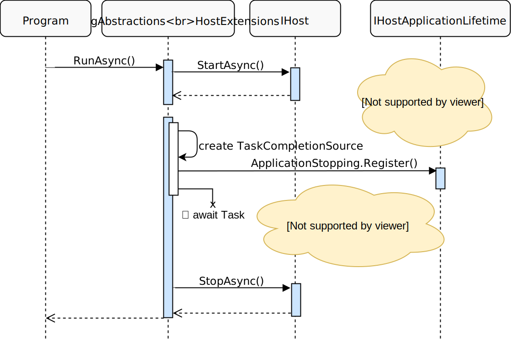
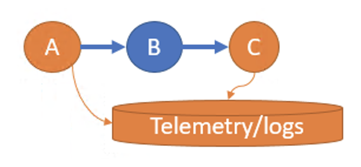

# Core 3.0 New Improvements

# Core 3.0

* GC Large page support

https://github.com/dotnet/docs/blob/master/docs/core/run-time-config/garbage-collector.md#large-pages

## Asp.net Core 3.0 Officials Documents

* gRPC
  ASP.NET Core 上的 gRPC 與標準 ASP.NET Core 功能整合，例如記錄、相依性插入（DI）、驗證和授權。
* SignalR
* New System.Text.Json
  * System.Text.Json
  * Known issues
      Support for OpenAPI / Swagger when using System.Text.Json is ongoing and unlikely to be available as part of the 3.0 release.
* IdentityServer4 supports web api and Spa
* Generic Host
  泛型主機的用途是將 HTTP 管線從 Web 主機 API 分離。 傳訊、背景工作及其他以泛型主機為基礎的非 HTTP 工作負載都可使用。泛型主機更可以重用例如設定、DI 和記錄。
  * 架構提供的服務
    * IHostApplicationLifetime
      處理啟動後和順利關機*工作*
    * IHostLifetime
      控制主機啟動及停止的*時機*
      Core 3.0 目前有三種實作
        1. ConsoleLifetime – Listens for SIGTERM or Ctrl+C and stops the host application.
        1. SystemdLifetime – Listens for SIGTERM and stops the host application, and notifies systemd about state changes (Ready and Stopping)
        1. WindowsServiceLifetime – Hooks into the Windows Service events for lifetime management
    * IHostEnvironment / IWebHostEnvironment
      設定檔
  * Run
  
* Default Enable HTTP/2

  ```C#
  var client = new HttpClient() 
  {
    BaseAddress = new Uri("https://localhost:5001"),
    DefaultRequestVersion = new Version(2, 0)
  };
  ```

* Endpoint Routes
* Health Check
* Background worker
[net-core-workers-as-windows-services](https://devblogs.microsoft.com/aspnet/net-core-workers-as-windows-services/)
* Performance improvement

## Asp.net Core 3.0 Something detail mentioned on the official blog

### Distributed Tracing and Logging

* 如下圖，在 2.0 時 B 沒有整合追蹤會功能會無法正常運作，但在 3.0 仍可以正常使用

* Supports standards / libraries
  * Asp.net Core 3.0 supports the W3C Trace Context format.
  * Asp.net Core 3.0 supports OpenTelemetry.

### API

#### BodyReader and BodyWriter

These new members of the HttpRequest and HttpResponse classes respectively allow you to leverage the high performance of System.IO.Pipelines.

*todo: test it.*

#### Worker Service

Core 2.2 是用 WebHost 並自行寫邏輯判斷是否在 windows service 再由 windows service 觸發

Core 3.0 的 background service 在不同 OS 寫法是有些許不一樣的，，兩個 `Use...` 可以同時寫在 code 裡，在各自環境不影響。

* Windows

加入 `Microsoft.Extensions.Hosting.WindowsServices` package 使用 `UseWindowsService()`

```C#
public static IHostBuilder CreateHostBuilder(string[] args) =>
Host.CreateDefaultBuilder(args)
    .UseWindowsService()
    .ConfigureServices(services =>
    {
        services.AddHostedService<Worker>();
    });
```

* Linux

加入 `Microsoft.Extensions.Hosting.SystemD` package 使用 `UseSystemd()`

```C#
public static IHostBuilder CreateHostBuilder(string[] args) =>
    Host.CreateDefaultBuilder(args)
        .UseSystemd()
        .ConfigureServices((hostContext, services) =>
        {
            services.AddHostedService<Worker>();
        });
```

#### Configuration

```C#
services.AddOptions();
services.Configure<GlobalAppSettings>(Configuration);
```

```C#
public DemoController(IOptions<GlobalAppSettings> options)
{
   Settings = options.Value;
   ...
}
```

#### plugin system (core 3.0)

#### Docker Enhancements (core 3.0)

*todo: not read yet*

#### API diff

*todo: not read yet*

## Asp.net Core 3.0 Issues fixed

## References

[blog announcing-net-core-3-0](https://devblogs.microsoft.com/dotnet/announcing-net-core-3-0/)

[large-page-support](https://docs.microsoft.com/zh-tw/windows/win32/memory/large-page-support)

[exploring-asp-net-core-3](https://andrewlock.net/series/exploring-asp-net-core-3/)

[troubleshooting-and-monitoring-distributed-apps](https://devblogs.microsoft.com/aspnet/improvements-in-net-core-3-0-for-troubleshooting-and-monitoring-distributed-apps/)

[exploring-dotnet-core-3-whats-new](https://auth0.com/blog/exploring-dotnet-core-3-whats-new/)

[try-the-new-system-text-json-apis](https://devblogs.microsoft.com/dotnet/try-the-new-system-text-json-apis/)

[netcore3-plugin-system](https://codetherapist.com/blog/netcore3-plugin-system/)

[asp-net-core-3-0-configuration-factsheet](https://www.red-gate.com/simple-talk/dotnet/net-development/asp-net-core-3-0-configuration-factsheet/)

[api diff](https://github.com/dotnet/core/tree/master/release-notes/3.0/api-diff)

[untangling-the-generic-host-startup-interactions](https://andrewlock.net/introducing-ihostlifetime-and-untangling-the-generic-host-startup-interactions/)

[net-core-workers-as-windows-services](https://devblogs.microsoft.com/aspnet/net-core-workers-as-windows-services/)
