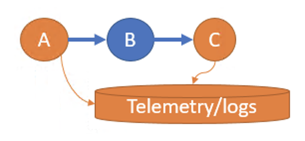

# Asp.net core 3.0 New Improvements

## Officials

## something new on the official blog only

### Distributed Tracing and Logging

* 如下圖，在 2.0 時 B 沒有整合追蹤會功能會無法正常運作，但在 3.0 仍可以正常使用

* Supports standards / libraries
  * Asp.net Core 3.0 supports the W3C Trace Context format.
  * Asp.net Core 3.0 supports OpenTelemetry.

### API

#### BodyReader and BodyWriter

These new members of the HttpRequest and HttpResponse classes respectively allow you to leverage the high performance of System.IO.Pipelines.

*todo: test it.*

#### Worker Service template

This is a new project template for long-running tasks such as Windows Services or Linux daemons.

*todo: test it.*

#### gRPC support

#### The New Built-in JSON Engine

* System.Text.Json
* Known issues
    Support for OpenAPI / Swagger when using System.Text.Json is ongoing and unlikely to be available as part of the 3.0 release.

#### HTTP/2

```C#
var client = new HttpClient() 
{
  BaseAddress = new Uri("https://localhost:5001"),
  DefaultRequestVersion = new Version(2, 0)
};
```

#### Configuration

*todo: test*

```C#
services.AddOptions();
services.Configure<GlobalAppSettings>(Configuration);
```

```C#
public DemoController(IOptions<GlobalAppSettings> options)
{
   Settings = options.Value;
   ...
}
```

#### plugin system (core 3.0)

#### Docker Enhancements (core 3.0)

*todo: not read yet*

#### API diff

*todo: not read yet*

## Issues fixed

## References

[troubleshooting-and-monitoring-distributed-apps](https://devblogs.microsoft.com/aspnet/improvements-in-net-core-3-0-for-troubleshooting-and-monitoring-distributed-apps/)

[exploring-dotnet-core-3-whats-new](https://auth0.com/blog/exploring-dotnet-core-3-whats-new/)

[try-the-new-system-text-json-apis](https://devblogs.microsoft.com/dotnet/try-the-new-system-text-json-apis/)

[netcore3-plugin-system](https://codetherapist.com/blog/netcore3-plugin-system/)

[asp-net-core-3-0-configuration-factsheet](https://www.red-gate.com/simple-talk/dotnet/net-development/asp-net-core-3-0-configuration-factsheet/)

[api diff](https://github.com/dotnet/core/tree/master/release-notes/3.0/api-diff)